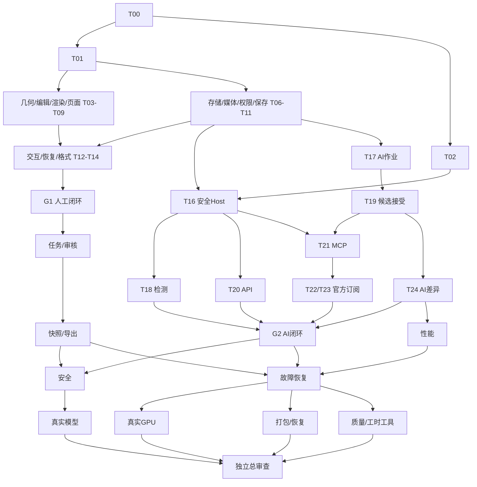

# WebLabel v0.1 Implementation Plan

> **For agentic workers:** 使用用户指定的 omp 多Agent执行，按 `docs/execution.md` 的隔离、测试、审查、集成流程逐任务推进。已安装相关开发skills时可以辅助，但它们不是本包执行前提；不要更换成另一套编排工具。

**Goal:** 从空目录交付浏览器中真实wgpu图片标注/审校工作台，并通过官方订阅运行时和多模态API生成可审阅、可撤销、可追溯的候选。

**Architecture:** React业务UI + Rust/WASM编辑内核 + wgpu画布；本地Rust服务管理SQLite/不可变媒体/版本；Node Host管理官方Codex/Claude和模型API，Python检测worker为可选组件。所有模型只能产候选，人工接受通过统一编辑/保存事务。

**Tech Stack:** Rust/Axum/SQLx/SQLite、wgpu/WGSL/WASM、React/TypeScript/Vite、Node24LTS、pnpm、Playwright/Vitest、Python/uv；具体成功组合由T00固定。

**Spec:** `docs/architecture.md` + `docs/contracts.md` + `docs/testing-contracts.md`；原草案 `docs/reference/original-proposal.md`。

## Global Constraints

- 桌面浏览器、静态PNG/JPEG、bbox+属性；v0.1正式部署只loopback。
- canonical连续像素坐标、EXIF可追溯，领域f64；DPR只用于显示。
- Rust编辑几何唯一来源；预测/文档/不可变版本/审核/快照分层。
- 保存CAS+幂等+同事务候选journal；一个逻辑拖动一个undo。
- 用户本人官方订阅运行时；无token抓取、凭证转售或未授权外发。
- 36项任务唯一DAG；最多3写+1只读review，隔离未经证实就串行。
- 未运行真实模型/硬件不能标live/hardware通过；mock仅工程验证。
- 文件64MiB、单边4096、像素16,777,216、decoded并发1、GPU纹理预算256MiB；超限明确拒绝，不静默降质。
- 不引入Mask/Polygon/视频/3D/云计费/实时协同/自研推理引擎。

## Review Focus

1. 方向含镜像的图片及DPR变化：显示与训练导出同一坐标。T03/T07/T14/T15。
2. 输入中断/IME/异步初始化：不创建半框、不误删、不把旧图挂新图。T09/T12。
3. 保存ACK、AI乱序、跨图片和跨版本：不清掉新dirty、不把候选覆盖人。T11/T13/T19/T24/T30。
4. 取消/进程崩溃/授权变更与恶意提示：不泄漏密钥、不越权执行、不自动重复计费。T16/T21/T25/T29/T32。
5. 审核后的新编辑与导出期间变化：review只绑定原版本、snapshot不漂移、negative不猜测。T26/T27。

## 阅读与执行顺序

从START_HERE.md开始；START_PROMPT.md可直接附给omp。主Agent读架构/契约/执行规程后只执行T00；不是一上来开多个Agent同时创建package.json。

任务卡各自包含输入、输出、文件归属、精确行为、断言起点、窄测试argv、交付证据和停止条件。TASKS.json是机读调度依据；STATUS.json唯一运行状态，初始全部pending。

## 子项目与关卡

| 关卡 | 能看见/验证的软件成果 | 范围 |
|---|---|---|
| G0 | 固定版本workspace与一致契约 | T00/T01；T02并行核验运行时 |
| G1 | 真wgpu画框、保存、刷新、导出并加载 | T03–T15 |
| G2 | 模型候选、授权、差异、接受与撤销整链 | T16–T25；mock可验工程但必须标记 |
| G3 | 审核/快照/权限/故障恢复/可重复构建 | T26–T30/T33 |
| G4 | Windows真实GPU与五种必需实际渠道 | T31/T32；缺条件为blocked |
| G5 | 测量工具、独立总审查与真实发布结论 | T34/T35 |

这不是严格按编号单线程：例如T26可以在AI后半段进行，T33/T34可在外部G4等待期间完成。以依赖和locks判断ready，不以表格行序猜可并行。

## 完整任务目录

| Task | 可独立验收成果 | 主角色 | 前置 |
|---|---|---|---|
| [T00](tasks/T00.md) | 空目录启动、工具链与可执行测试入口 | main | 无 |
| [T01](tasks/T01.md) | 领域模型、共享契约、schema与黄金夹具 | wl-core | T00 |
| [T02](tasks/T02.md) | 官方运行时与模型接入探针 | wl-researcher | T00 |
| [T03](tasks/T03.md) | 坐标变换、矩形几何与空间命中 | wl-core | T01 |
| [T04](tasks/T04.md) | 编辑命令、工具状态与单步撤销 | wl-core | T03 |
| [T05](tasks/T05.md) | 真实wgpu图像与实例矩形渲染器 | wl-renderer | T03 |
| [T06](tasks/T06.md) | SQLite、不可变文件仓库与服务器骨架 | wl-backend | T01 |
| [T07](tasks/T07.md) | 图片导入、EXIF规范化与有界媒体作业 | wl-backend | T06 |
| [T08](tasks/T08.md) | React工作台外壳与虚拟对象列表 | wl-web | T01 |
| [T09](tasks/T09.md) | WASM facade与浏览器画布生命周期 | wl-renderer | T04, T05, T08 |
| [T10](tasks/T10.md) | 本地认证、项目角色和不可变标注规范 | wl-backend | T06 |
| [T11](tasks/T11.md) | 不可变保存版本、CAS与幂等事务 | wl-backend | T04, T10 |
| [T12](tasks/T12.md) | 矩形编辑、快捷键与密集选择全链路 | wl-core | T09 |
| [T13](tasks/T13.md) | IndexedDB恢复与单飞保存队列 | wl-web | T09, T11 |
| [T14](tasks/T14.md) | 原生、YOLO、COCO格式与安全导入预览 | wl-backend | T07, T10 |
| [T15](tasks/T15.md) | 人工标注最小纵向闭环与第一关卡 | wl-qa | T07, T09, T10, T11, T12, T13, T14 |
| [T16](tasks/T16.md) | 安全Agent Host、进程监管与provider抽象 | wl-ai | T01, T02, T10 |
| [T17](tasks/T17.md) | 持久化模型作业、预测与事件流 | wl-backend | T11, T07 |
| [T18](tasks/T18.md) | 真实CPU检测器与坐标反变换 | wl-ai | T07, T16 |
| [T19](tasks/T19.md) | 候选校验、原子接受与可撤销来源 | wl-core | T04, T17 |
| [T20](tasks/T20.md) | OpenAI/Luna、Anthropic与MiMo HTTP适配器 | wl-ai | T16 |
| [T21](tasks/T21.md) | 受限MCP语义工具与run级权限 | wl-ai | T16, T19 |
| [T22](tasks/T22.md) | 官方Codex订阅运行时适配 | wl-ai | T02, T21 |
| [T23](tasks/T23.md) | 官方Claude订阅/Sonnet运行时适配 | wl-ai | T02, T21 |
| [T24](tasks/T24.md) | AI面板、差异预览与按上下文接受 | wl-web | T13, T19 |
| [T25](tasks/T25.md) | 模型全链路、外发授权与差异化AI关卡 | wl-ai | T18, T20, T22, T23, T24 |
| [T26](tasks/T26.md) | 任务租约、版本审核与负样本语义 | wl-backend | T15 |
| [T27](tasks/T27.md) | 不可变数据集快照与可校验交付 | wl-backend | T14, T26 |
| [T28](tasks/T28.md) | 密集对象性能、按需绘制与资源预算 | wl-renderer | T12, T13, T24 |
| [T29](tasks/T29.md) | 安全攻击面与恶意输入专项验收 | wl-qa | T25, T27 |
| [T30](tasks/T30.md) | 故障注入、恢复与长会话一致性 | wl-qa | T25, T26, T27, T28 |
| [T31](tasks/T31.md) | 目标机器真实WebGPU与性能验收 | wl-qa | T30 |
| [T32](tasks/T32.md) | 真实订阅、Luna/MiMo与检测器验收 | wl-qa | T25, T29 |
| [T33](tasks/T33.md) | 本地发行构建、诊断、备份恢复与使用文档 | wl-backend | T27, T29, T30 |
| [T34](tasks/T34.md) | 标注效率与质量评估工具 | wl-web | T15, T24, T27, T30 |
| [T35](tasks/T35.md) | 独立总审查、重放验收与发布状态 | main | T31, T32, T33, T34 |

## 主要依赖图

图用于理解模块；机器精确依赖以TASKS.json为准。

## 完成定义

首版完整完成需要G0–G5按实际证据通过，尤其Codex订阅、Claude订阅/Sonnet、Luna API、MiMo API和真实检测器不能互相替代。缺账号/权限/硬件可交limited preview，但T35不能done。每个任务的代码完成和provider的live_passed是不同状态。

本执行包只完成计划及结构校验，未实现产品，不包含可运行的pnpm dev业务应用。T00负责建立这些命令；直接运行前请先让omp执行T00。
