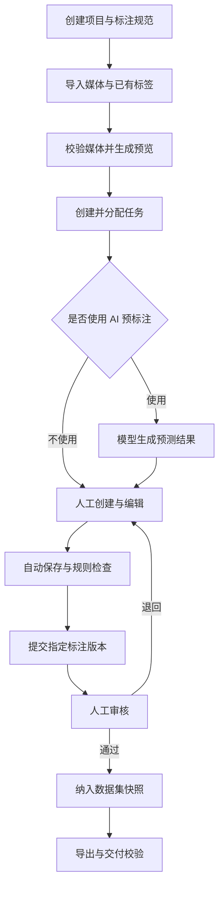
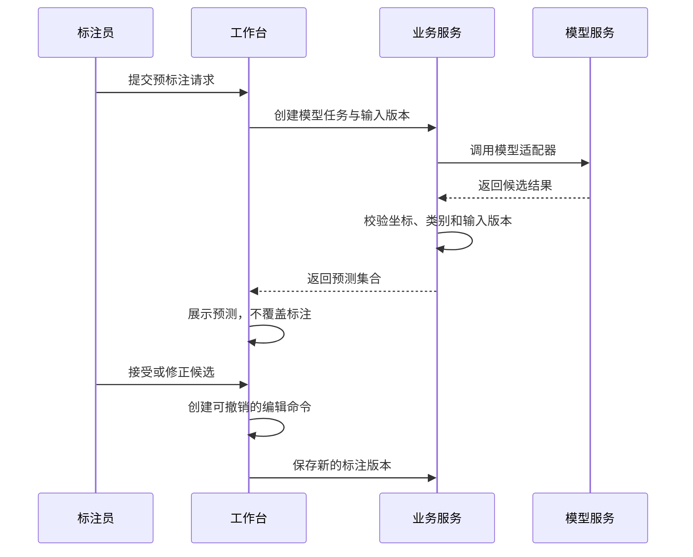
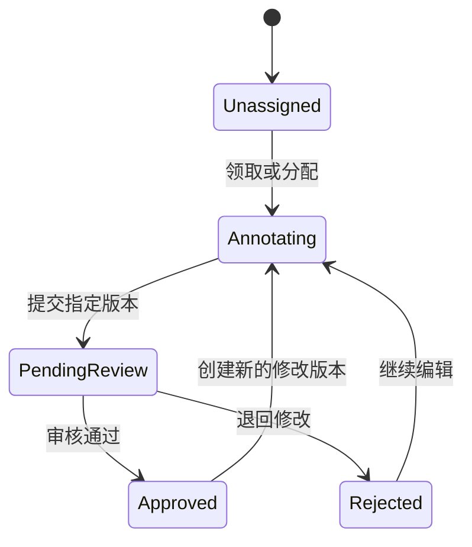
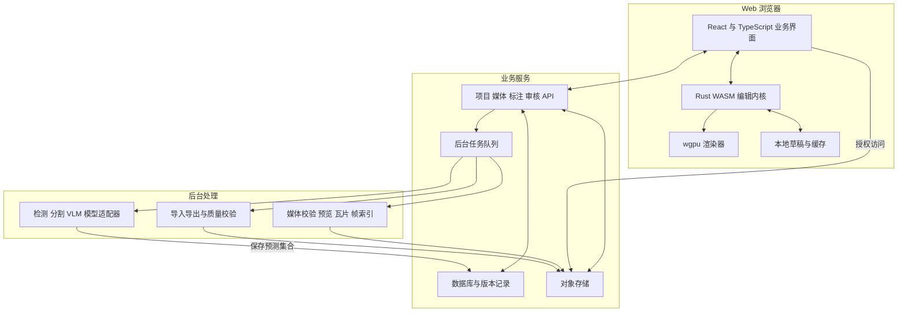

# Web 端基于 wgpu 的视觉任务标注平台

## 核心功能、技术架构与 MVP 建设方案

| 项目 | 内容 |
| --- | --- |
| 文档版本 | v0.1 |
| 文档日期 | 2026-09-24 |
| 文档性质 | 产品与技术设计草案，不代表已实现或已验证的能力 |
| 目标读者 | 产品负责人、前后端工程师、图形工程师、算法工程师、测试工程师 |
| 首期定位 | 以图片目标检测为主，支持 AI 预标注、人工修正、审核与训练数据交付 |
| 核心技术方向 | Web 业务界面 + Rust/WASM 编辑内核 + wgpu 画布 + 服务端业务与模型服务 |

> 本文基于“Web 端、wgpu、高性能视觉标注、AI 辅助”的需求整理。默认首期面向桌面浏览器、鼠标键盘交互和 2D 图片；移动端、视频、点云等属于扩展范围。文中优先级、模块边界和验收指标是建议方案，不是已确认的产品承诺。

---

## 目录

1. [产品定位与建设原则](#1-产品定位与建设原则)
2. [视觉任务范围与优先级](#2-视觉任务范围与优先级)
3. [用户角色与完整业务闭环](#3-用户角色与完整业务闭环)
4. [项目类别与标注规范管理](#4-项目类别与标注规范管理)
5. [媒体资产与数据集管理](#5-媒体资产与数据集管理)
6. [人工标注工作台](#6-人工标注工作台)
7. [AI-预标注与交互式辅助](#7-ai-预标注与交互式辅助)
8. [保存恢复撤销与版本管理](#8-保存恢复撤销与版本管理)
9. [任务分配与质量审核](#9-任务分配与质量审核)
10. [数据集版本与导入导出](#10-数据集版本与导入导出)
11. [wgpu-渲染与编辑内核](#11-wgpu-渲染与编辑内核)
12. [整体系统架构](#12-整体系统架构)
13. [核心数据模型](#13-核心数据模型)
14. [接口与后台任务设计](#14-接口与后台任务设计)
15. [视频标注扩展](#15-视频标注扩展)
16. [安全部署与运维](#16-安全部署与运维)
17. [MVP-范围与实施顺序](#17-mvp-范围与实施顺序)
18. [测试与验收标准](#18-测试与验收标准)
19. [主要风险与设计约束](#19-主要风险与设计约束)
20. [官方参考资料](#20-官方参考资料)

---

## 1. 产品定位与建设原则

### 1.1 产品定位

建设一个以 wgpu 高性能画布为核心的视觉标注平台，打通以下闭环：

```text
导入数据
  → 定义类别与标注规范
  → AI 生成候选标注
  → 人工接受、拒绝与修正
  → 质量检查与审核
  → 固化数据集版本
  → 导出训练数据
```

平台不只是“在图片上画框”。它需要同时保证：

- **数据正确：**坐标、类别、媒体版本与导出结果一致。
- **操作高效：**创建、选择、修改、查找对象的交互足够顺畅。
- **结果可靠：**编辑可恢复，审核可追溯，AI 不覆盖人工成果。
- **交付可用：**导出结果能被目标训练程序正确读取。

### 1.2 wgpu 的职责边界

方案采用 Rust 编写编辑核心与渲染模块，编译到 WebAssembly，通过 wgpu 使用浏览器图形后端。wgpu 提供图形与计算基础设施，但业务界面、标注工具、对象选择、撤销重做、审核与数据集版本均需要平台自行建设。[1][2]

建议将 wgpu 用于图像、几何、Mask 与交互覆盖层，不将整个业务 UI 都搬进 GPU 画布。

```text
DOM / React：表单、菜单、列表、属性面板、文本编辑、项目管理
Rust Core：文档状态、几何、工具状态机、编辑命令、撤销重做
wgpu：图像、瓦片、标注几何、Mask、控制点与交互反馈
服务端：权限、持久化、任务、审核、模型调用与导出
```

### 1.3 建设原则

| 原则 | 具体要求 |
| --- | --- |
| 正确性优先 | 先保证不丢数据、坐标不偏移，再追求复杂渲染效果 |
| 纵向闭环优先 | 先实现图片导入到训练数据导出的完整链路 |
| 预测与标注分离 | 模型输出是候选，不是可以随意覆盖的正式标注 |
| 数据与显示分离 | 标注保存原始几何与语义，颜色和透明度只是显示方式 |
| 模型可替换 | 不把业务流程绑定到特定 GPT、检测或分割模型 |
| 简化并发 | 首期采用任务占用与版本检查，不直接引入实时多人共同编辑 |
| 渐进扩展 | 先矩形框，再 Polygon/Mask，最后视频等复杂任务 |
| 可测试性 | 几何、坐标、导入导出、版本逻辑可以脱离 GPU 单独测试 |

### 1.4 首期不包含的能力

首期不建设完整模型训练平台、主动学习闭环、点云编辑器、多传感器融合、实时多人共同修改同一对象、复杂计费系统或通用插件市场。

这些能力可以保留扩展边界，但不应成为图片检测 MVP 的前置依赖。

---

## 2. 视觉任务范围与优先级

### 2.1 优先级定义

| 优先级 | 定义 |
| --- | --- |
| P0 | 首个可交付版本必须完成的能力 |
| P1 | 首期闭环稳定后的增强能力 |
| P2 | 需要独立规划的后续扩展 |

### 2.2 任务类型规划

| 视觉任务 | 主要标注数据 | 优先级 | 关键复杂度 |
| --- | --- | --- | --- |
| 图片目标检测 | 水平矩形框、类别、对象属性 | P0 | 框编辑效率、重叠选择、坐标正确性 |
| 图片分类 | 图片级单选或多选标签 | P1，可按业务提前 | 标签规则与批量操作 |
| 实例分割 | 每实例 Polygon 或 Mask | P1 | 孔洞、多个连通区域、轮廓与 Mask 编辑 |
| 语义分割 | 像素类别、ignore 区域 | P1 | 画笔、覆盖语义、类别图存储 |
| 旋转目标检测 | 旋转框或四点框 | P1，按行业决定 | 角度、顶点顺序与格式转换 |
| 关键点与姿态 | 点、骨架、可见性 | P2 | 骨架模板与遮挡语义 |
| 视频检测与跟踪 | 帧级几何、轨迹、关键帧 | P2 | 帧身份、插值、跨帧对象 ID |
| OCR 与文档视觉 | 区域、文本、阅读顺序与关系 | P2 | 文本编辑与结构化关系 |
| 点云与 3D | 3D 框、点标签、传感器关联 | 单独规划 | 相机、坐标系、空间交互与多视图 |

CVAT 将矩形、多边形、折线、关键点、骨架等划分为不同工具，可作为任务拆分的参考，但不必在首期同时实现。[8]

### 2.3 首期范围约束

首期围绕单张图片上的水平矩形框进行完整设计。内部几何采用可扩展类型，但只实现实际需要的变体，不为所有未来任务预先建设复杂抽象。

---

## 3. 用户角色与完整业务闭环

### 3.1 用户角色

| 角色 | 主要职责 |
| --- | --- |
| 项目管理员 | 创建项目、维护规范、管理成员、分配任务、管理模型与导出 |
| 标注员 | 领取任务、编辑标注、处理预测、提交审核 |
| 审核员 | 检查标注、提出问题、退回修改或通过指定版本 |
| 只读成员 | 查看项目、统计或已授权的数据集版本 |

首期可以采用项目级角色控制。是否允许审核自己的标注应当是项目配置，而不是隐含行为。

### 3.2 主业务流程



### 3.3 状态必须表达真实含义

至少区分以下媒体处理状态：

```text
尚未处理
正在处理
已有部分标注
已检查且确认没有目标
标注完成
```

审核状态另行记录，例如待提交、待审核、已通过、已退回。

**空标注集合不自动等于负样本。**只有被明确检查并确认没有目标的数据，才可以作为已完成的负样本进入相应导出范围。

---

## 4. 项目、类别与标注规范管理

### 4.1 项目基础配置

项目至少包含名称、描述、任务类型、媒体范围、成员、标注规范、类别集合、审核要求与导出配置。

模型调用策略也属于项目配置，例如是否允许调用外部模型、允许哪些提供方，以及哪些媒体可以发送到外部。

### 4.2 类别定义

每个类别建议包含：

| 字段 | 用途 |
| --- | --- |
| `label_id` | 稳定的内部标识 |
| `name` | 显示名称 |
| `color` | 工作台显示颜色 |
| `shortcut` | 创建或切换类别的快捷键 |
| `allowed_geometry_types` | 允许的几何类型 |
| `attribute_schema` | 属性定义与约束 |
| `ontology_version_id` | 所属标注规范版本 |

不要将侧栏排序、显示名称或导出类别编号当作永久类别 ID。

### 4.3 对象属性

首期建议支持枚举、布尔值、数值与短文本，并允许设置必填项和默认值。

例如：

```text
类别：person
属性：
  occlusion：none / partial / severe
  truncated：true / false
  helmet_state：wearing / not_wearing / unknown
```

属性是否需要标注、如何判断，应写进规范。不能只增加字段，却没有一致的填写标准。

### 4.4 标注规范

至少明确：

- 框可见部分，还是推测完整轮廓。
- 截断、遮挡、模糊、小目标的处理方式。
- 是否允许框超出图像边界。
- 不确定目标、ignore 区域和负样本的处理方式。
- 重叠对象、群体目标和难以区分实例的处理方式。

建议在工作台内提供规范入口和正反例，不依赖标注员切换到外部文档查阅。

### 4.5 规范版本

类别重命名、合并、删除和属性变更，应生成新的规范版本或执行明确的数据迁移。

历史标注与历史数据集版本继续引用对应的旧规范。不得通过修改当前类别配置，静默改变已导出版本的含义。

---

## 5. 媒体资产与数据集管理

### 5.1 导入能力

P0 支持多文件图片上传、上传进度、失败提示与重试、已有标注导入，以及媒体格式和尺寸校验。

P1 增加分片上传、断点续传、大目录导入、对象存储接入、后台归档包导入与去重提示。

归档包导入需要限制文件数量、解压体积与路径范围，不能直接信任压缩包中的文件路径。

### 5.2 媒体身份

每个资产使用稳定的 `asset_id`。媒体内容变更则创建新的媒体版本，而不是继续使用同一版本悄悄替换文件。

建议记录：

```text
asset_id / asset_revision_id
原始文件名与媒体类型
原始文件内容哈希
原始尺寸与方向信息
标注基准图尺寸与内容哈希
原始图到基准图的变换信息
来源、导入批次与创建时间
```

文件名只用于显示与导出命名，不作为唯一身份。

### 5.3 原始文件、基准图与预览图

建议采用以下关系：

```text
不可变原始文件
  → 明确方向与坐标约定的标注基准图
    → 缩略图
    → 预览图
    → 多级图像瓦片
```

平台内部统一使用标注基准图坐标。导出时，要么导出该基准图及其标签，要么将标签显式转换回所选原始图坐标。

处理 EXIF 方向、旋转和裁剪时，应保存可追溯变换；不能显示方向已修正的图片，却导出未修正图片和同一套坐标。

预览图只用于显示。它的分辨率不能改变持久化标注的坐标基准。

### 5.4 数据浏览与筛选

P0 提供缩略图网格、分页或虚拟列表，按类别、任务状态、审核状态和标注员筛选，并支持批量分配。

P1 增加按目标数量、模型分数、疑似重复、异常尺寸、模型运行和质量问题筛选。

### 5.5 大图策略

首期应明确允许的图像尺寸与文件大小。超过能力范围的数据可以拒绝并说明原因，或者仅在明确标识的预览模式下打开，不得静默降分辨率后按原图质量完成标注。

P1 再通过金字塔、瓦片与缓存支持更大图像。

---

## 6. 人工标注工作台

### 6.1 页面布局

建议采用五个区域：

| 区域 | 内容 |
| --- | --- |
| 顶部栏 | 项目、任务、保存状态、提交审核、快捷操作 |
| 左侧工具栏 | 选择、矩形、平移及后续几何工具 |
| 中央画布 | 图像与标注交互 |
| 右侧面板 | 类别、对象列表、属性、预测与质量问题 |
| 底部区域 | 图片切换、进度；视频扩展后提供时间轴 |

文本输入、菜单和表格保留在 DOM 中。画布与 DOM 之间通过明确的状态与命令接口同步。

### 6.2 画布基础交互

P0 必须具备鼠标中心缩放、平移、适应窗口、原始比例查看、十字光标、当前坐标显示，以及快速切换前后图片。

控制点、选中轮廓和点击容差以屏幕空间设计，不能随着缩小图像而变得无法操作。

亮度、对比度等辅助观察功能属于显示变换。默认不修改媒体内容，也不改变模型输入。

### 6.3 矩形框工具

| 功能组 | 核心能力 |
| --- | --- |
| 创建 | 拖拽创建、连续创建、保持当前类别、取消当前创建 |
| 修改 | 整体移动、四边与四角调整、数值编辑 |
| 选择 | 单选、多选、框选、重叠对象循环选择 |
| 管理 | 删除、复制、修改类别、隐藏、锁定 |
| 效率 | 类别快捷键、重复上一类别、快速定位对象 |
| 恢复 | 撤销、重做、取消未提交交互 |

密集目标场景下，小目标命中、重叠选择、快捷键和对象列表联动应当优先打磨。

### 6.4 对象列表与属性面板

对象列表至少显示类别、对象 ID、来源、可见性、锁定状态和质量问题。

点击对象列表可定位画布对象；选择画布对象同步定位列表。修改类别或属性应通过统一编辑命令完成。

隐藏、锁定、选择和高亮属于编辑器状态。除非项目明确要求，不应混入训练标签语义。

### 6.5 工具状态机

工具逻辑应独立于渲染函数，例如：

```text
Idle
  → CreatingBox
  → DraggingObject
  → ResizingBox
  → SelectingRegion
  → Panning
```

每种状态定义进入条件、可接受的输入、预览效果、提交方式和取消方式。

指针移出画布、浏览器失焦、触发取消、切换工具和切换图片，都必须有明确行为，避免出现半完成对象或拖动状态残留。

### 6.6 Polygon 与 Mask 扩展

P1 增加顶点插入与删除、轮廓修正、画笔与橡皮、正负点辅助分割、孔洞、多个连通区域、实例拆分与合并。

实例 Mask 与语义类别图应采用不同数据语义。渲染时显示为半透明区域，并不意味着它们可以共用一份最终颜色截图作为存储。

---

## 7. AI 预标注与交互式辅助

### 7.1 模型职责

| 模型类型 | 建议职责 |
| --- | --- |
| 检测器 | 根据固定类别或开放词汇生成候选框 |
| 分割器 | 根据图像、点、框或文本生成候选区域 |
| 分类模型 | 生成图片级或对象级类别候选 |
| VLM | 语义理解、规则解释、复杂描述、疑似问题发现 |
| 跟踪器 | 视频中传播对象位置与身份 |

不要默认 VLM 能提供足够精确的框坐标，也不要将其自报置信度当作校准后的正确概率。

对类别已明确的检测项目，检测器应能直接处理全部目标类别。VLM 不应成为必须通过的存在性筛选步骤，否则前置漏判会阻断后续检测。

具体模型名称、接口、许可、成本和可用能力应在接入时验证，平台设计不依赖任何未经验证的型号。Label Studio 的 ML Backend 可作为批量预标注与交互式模型接入的参考。[7]

### 7.2 模型能力注册

适配器建议声明：

```text
adapter_id / model_version
支持任务与输出几何类型
支持的图片、文本、点、框和已有标注输入
输入尺寸约束与预处理方式
坐标约定与结果反变换方式
类别映射与属性映射
运行位置、超时、并发和资源限制
是否允许外部数据传输
```

结构化输出只能帮助约束字段格式，不能替代几何、类别和实际识别正确性的检查。

### 7.3 批量预标注

用户选择图片集合、模型、目标类别与参数后创建异步任务。

任务需展示排队、执行、成功、部分失败、失败、取消等状态，并提供图片级错误详情。

结果进入独立预测层。用户可以筛选、批量接受、逐项接受、拒绝或修正，但系统必须保留模型原始结果和来源。

### 7.4 交互式辅助

建议逐步支持：

1. **文本辅助：**描述目标，得到候选框或区域。
2. **点与框辅助：**根据用户提示生成分割候选，并支持追加修正提示。
3. **已有对象辅助：**修正边界、寻找相似对象、提示疑似漏标或错标。

P0 只需一个可替换的检测模型接口；交互式分割和 VLM 审标放入 P1。

### 7.5 异步结果防过期

每个请求至少关联：

```text
request_id
asset_revision_id
ontology_version_id
model_version
输入提示与参数
输入编辑版本或交互上下文标识
```

结果返回时检查上下文：

- 媒体是否仍是同一版本。
- 类别映射是否仍有效。
- 用户是否已修改相关对象。
- 当前交互是否已被更新的请求替代。

过期结果可以保存供比较，但不能直接写入当前标注。用户切换图片后返回的结果仍归属于原图片，而不是当前画布。

### 7.6 预测接受与版本关系

接受预测应创建正式编辑操作，并保留 `prediction_id` 引用。

人工修正更新标注草稿，不修改原始预测。重新运行模型创建新的模型运行与预测集合，不替换旧的人工结果。



### 7.7 AI 质量与效率指标

记录模型运行、原始候选、接受与拒绝、人工修改、耗时和审核结果。

评估应关注相同质量要求下的人工总耗时、漏标情况与审核退回率，而不是只统计自动生成对象数量。

模型分数可用于排序和筛选；未经验证的分数不能直接决定免审。对 AI 判定正常的样本仍应保留抽检。

---

## 8. 保存、恢复、撤销与版本管理

### 8.1 数据层分离

| 数据层 | 含义 |
| --- | --- |
| Prediction | 某次模型运行生成的原始候选结果 |
| Annotation Draft | 当前正在编辑的状态 |
| Annotation Revision | 持久化后的不可变标注版本 |
| Review Decision | 对指定标注版本的审核决定 |
| Dataset Version | 固定媒体、规范、标注与划分的数据集快照 |

这些层可以由同一数据库管理，但不能混成一份不断覆盖的 JSON。

### 8.2 编辑命令与撤销重做

建议定义创建对象、删除对象、修改几何、修改属性、接受预测和批量修改等命令。

一次拖动属于一个逻辑操作。指针移动过程更新临时预览，提交时形成一个撤销单元。

撤销已经保存的操作时，应产生新的编辑结果与版本，而不是删除历史版本。首期撤销范围限定在当前任务或当前编辑会话，跨会话撤销需要另行设计。

### 8.3 保存实现策略

P0 可以在每次逻辑操作结束后采用防抖保存，以“单张图片完整标注快照 + 基础版本号”实现服务器持久化。

这不等于每次指针移动都上传完整文档。对于大量对象和 Mask，P1 再增加增量补丁、分块上传和批量合并。

服务端保存至少包含：

```text
operation_id：用于幂等处理
base_revision：客户端编辑基于的版本
new_document 或 change_set
```

写入成功后返回新版本。版本不匹配时明确报告冲突，不能默认最后写入覆盖之前的结果。

### 8.4 保存状态

工作台应区分：

```text
有未保存修改
已保存本地，等待同步
正在同步
已同步到服务器
本地保存失败
服务器保存失败
版本冲突
```

只有完成对应持久化步骤，才能显示相应状态。请求发出不等于保存成功。

### 8.5 本地恢复

本地草稿保存标注数据、基础版本和待同步操作，不只保存渲染资源。

恢复时需要与服务器版本比较。若服务器已变化，提供冲突处理路径，不能直接覆盖。

本地存储存在配额、清理和访问失败等情况，因此不是唯一可靠副本。应明确显示未能落盘的状态，并允许导出草稿作为恢复手段。

### 8.6 并发编辑

首期采用任务占用或租约，以及服务端版本检查。

租约过期、浏览器休眠、多标签页和异常断线不能突破版本保护。实时多人协同、CRDT 和跨用户撤销放在后续独立评估。

---

## 9. 任务分配与质量审核

### 9.1 任务组织

一个任务包含一组媒体资产、对应规范版本、负责人和处理状态。

支持领取、分配、转交、提交、退回和关闭。任务列表展示完成进度与阻塞原因。

### 9.2 审核状态机



已通过的旧版本保留原审核记录；新修改版本不能继承“已审核通过”的结论。

### 9.3 人工审核

审核员需要查看标注和原图、定位对象、提出问题、填写退回原因，以及比较修改前后差异。

问题可绑定图片、对象或区域。对象被删除或修改后，问题仍应能追溯到原版本。

### 9.4 自动规则检查

| 类型 | 处理建议 |
| --- | --- |
| 未知类别、缺失必填属性、重复对象 ID | 阻止提交或导出 |
| 非法数值、非有限坐标、负宽高、零面积 | 阻止提交或导出 |
| 超出边界且违反项目规范 | 阻止提交或要求修正 |
| 面积异常、疑似重复框、对象数量异常 | 生成警告，允许人工判断 |
| 空标注但未确认负样本 | 不视为已完成负样本 |
| 模型候选尚未处理 | 根据项目策略提示或限制提交 |

### 9.5 质量统计

P0 统计待审数量、退回原因、规则错误和基本耗时。

P1 增加分层抽检、标准样本、标注员一致性比较、模型质量分析和困难样本队列。CVAT 的质量控制功能可作为工作流参考。[10]

审核时间与标注时间应区分；长时间后台挂起不宜直接计入有效工作时长。

---

## 10. 数据集版本与导入导出

### 10.1 内部格式与交换格式

平台原生格式负责无损保存媒体引用、几何、属性、来源与版本信息。

YOLO、COCO 等作为外部适配格式。不要为迎合某个训练格式而丢弃平台内部必需的语义。

### 10.2 P0 导入导出

P0 支持平台原生格式、YOLO 检测格式和 COCO 检测格式。[11][12]

不同格式的几何、类别和命名约定由独立适配器处理，不能散落在 UI 中。

### 10.3 YOLO 检测坐标转换

内部水平框使用基准图连续像素坐标：

```text
[x_min, y_min, x_max, y_max]
```

对宽 `W`、高 `H` 的图像，导出为：

```text
center_x = ((x_min + x_max) / 2) / W
center_y = ((y_min + y_max) / 2) / H
width    = (x_max - x_min) / W
height   = (y_max - y_min) / H
```

标签行形式为：

```text
class_id center_x center_y width height
```

类别编号从零开始，并在当前数据集版本中固定。该约定对应 Ultralytics 的 YOLO 检测数据格式。[11]

不使用旧式整数端点约定中的 `+1` 宽高计算。是否允许超界框应先由项目规则处理，而不是在导出时静默截断。

### 10.4 COCO 检测转换

检测框转换为：

```text
[x_min, y_min, width, height]
```

导出器负责图像 ID、标注 ID 和类别 ID 的映射，并验证引用完整性。Mask、关键点或自定义属性的兼容性需要分别定义，不能只因为使用了 COCO 文件名就宣称全部兼容。[12]

### 10.5 固定数据集版本

数据集版本至少固定：

```text
媒体资产版本及内容哈希
每张图片采用的标注版本
标注规范与类别映射
训练 / 验证 / 测试划分
筛选条件与审核要求
导出器版本及参数
```

先形成不可变快照，再异步生成文件。导出期间发生的新编辑不应混入已创建的快照。

### 10.6 导出校验与信息损失报告

导出前检查缺失媒体、类别映射、非法几何、未审核数据、负样本状态和重复文件路径。

目标格式无法表示的信息必须明确报告，例如对象属性、审核记录、轨迹或旋转框。涉及几何降级时，应让用户确认转换策略，不能静默改变含义。

导出结果包含类别映射、文件清单、统计、校验结果和必要的警告。

### 10.7 数据划分

建议支持按媒体来源组、视频、采集批次或场景分组划分，以减少相关样本跨集合造成的数据泄漏风险。

划分结果保存到数据集版本，不在每次导出时重新随机生成。

---

## 11. wgpu 渲染与编辑内核

### 11.1 坐标体系

明确区分：

```text
原始文件坐标
标注基准图坐标
画布局部 CSS 坐标
Canvas 物理像素坐标
GPU 裁剪空间坐标
```

标注文档统一保存基准图坐标。设 `M_view` 将基准图转换到画布局部 CSS 坐标：

```text
p_canvas_css = M_view × p_image
p_image      = inverse(M_view) × p_canvas_css
```

浏览器指针坐标需要先扣除 Canvas 在页面中的偏移。DPR 用于 CSS 尺寸与物理渲染尺寸的换算，不直接进入标注坐标。

首期建议不对 Canvas DOM 元素叠加额外 CSS 旋转或复杂变换；确需支持时，必须将这些变换也纳入输入映射。

### 11.2 几何约定

对宽 `W`、高 `H` 的基准图，图像边界为 `[0, W] × [0, H]`，像素中心为 `(i + 0.5, j + 0.5)`。

矩形使用连续浮点边界，宽高为端点差值。Mask 对应离散像素，需要独立定义采样与栅格化规则。

人工与 AI 输入都必须转换到该约定后再进入文档。

### 11.3 模型坐标反变换

模型输入常包含缩放、补边、裁剪等步骤。适配器需保存这些变换，并反变换模型结果：

```text
基准图 → 裁剪 → 缩放 → 补边 → 模型输入
模型输出 → 去补边 → 逆缩放 → 恢复裁剪偏移 → 基准图坐标
```

对于旋转或非轴对齐变换，应先转换几何本身，再根据目标类型处理，不能只分别转换两个端点后假定仍是同一水平框。

### 11.4 逻辑渲染层

| 层 | 内容 | 更新特点 |
| --- | --- | --- |
| 图像层 | 原图、预览或瓦片 | 视口变化与资源加载时更新 |
| 区域层 | Mask、语义类别图 | 区域编辑与显示设置变化时更新 |
| 几何层 | 框、多边形、折线、关键点 | 对象变化时更新 |
| 交互层 | 控制点、选中态、绘制预览 | 指针与选择变化时更新 |
| 信息层 | 类别名称、对象 ID、测量提示 | 视口与对象信息变化时更新 |

逻辑分层不要求每层对应单独 Render Pass。具体合并方式根据透明混合、资源使用与性能测试决定。

### 11.5 批量绘制与增量更新

矩形、控制点等采用批量绘制；多边形缓存几何；Mask 使用纹理表达。

优先实现视口剔除、GPU 资源复用、局部缓冲区更新、静态对象与正在编辑对象分离，以及按需重绘。

按需重绘的触发条件包括输入、视口变化、资源加载、文档修改和动画，不是在每个浏览器帧都无条件重建全部数据。

字体与标签应避免为每个对象创建大量独立 DOM 节点。可先限制低缩放级别的标签显示，再根据需求建设 GPU 字体图集。

### 11.6 命中检测

P0 采用 CPU 几何测试，并在对象数量增加后加入空间索引。

屏幕空间点击容差通过当前缩放换算到图像空间。重叠对象按明确规则排序，并支持循环选择。

Mask 或复杂场景可增加局部数据查询与异步 GPU Picking，但不应每次指针移动都同步等待 GPU 回读。

### 11.7 大图、LOD 与缓存

一张 `10000 × 10000` 的 RGBA8 图像，单层像素数据约为 `381.5 MiB`，计算为 `10000 × 10000 × 4 / 1024²`，尚未包含解码副本、Mip、Mask 或其他缓存。

因此 P1 需要图像金字塔、视口瓦片加载、预取与缓存淘汰。

分别控制解码内存、GPU 纹理、Mask 数据和预取资源预算。资源上限应通过设备能力与实际测试确定，不能仅按桌面显卡的理想配置设计。

瓦片显示需要验证边缘采样、接缝、缩放切换与标注对齐。

### 11.8 Mask 数据与显示分离

实例分割可采用每实例独立的稀疏 Mask 或分块编码；语义分割可采用类别 ID 图与 ignore 值。是否允许实例重叠由任务定义决定。

显示时使用颜色表、透明度与轮廓，不将颜色混合结果当作标签。

低分辨率 Mask 只用于预览。编辑、提交与导出必须明确作用分辨率，并保存原始语义数据。

画笔编辑建议记录涉及瓦片的差异或局部快照，避免每次操作复制整张 Mask。

### 11.9 WASM 与 UI 边界

编辑内核拥有当前几何与工具状态。React 保存用于显示的投影状态，不另建一份可以独立修改的几何真相。

JS 到 WASM 传输入事件或语义命令；WASM 到 JS 返回必要的增量状态、选择变化与保存信号。

避免每个指针事件都序列化完整文档。大块图片或 Mask 数据采用明确的二进制接口，并实测跨边界复制成本。

### 11.10 浏览器能力检测与设备恢复

WebGPU 要求安全上下文，部署时需满足 HTTPS 等条件，并在运行时检测实际能力。[3]

启动时检查适配器、所需特性、纹理与缓冲区限制。wgpu 的 WebGL 路径不等于 WebGPU 计算能力的完全替代，降级路径必须限制功能并单独测试。[1][2]

设备丢失后应停止使用失效资源，重新创建渲染资源，并从编辑文档与媒体重新构建画布。[4]

CPU 与持久化数据是业务状态来源。GPU 纹理不是标注的唯一副本。

### 11.11 浏览器端推理

浏览器端推理属于 P2 可选增强。ONNX Runtime Web 提供 WebGPU 执行相关接口，可作为探索路径，但模型算子支持、设备占用与渲染器之间的数据传递仍需实测。[13]

不要因为渲染和推理都使用 WebGPU，就假定二者能够自动零拷贝共享纹理或设备。

---

## 12. 整体系统架构

### 12.1 推荐形态

建议采用模块化单体业务服务，加后台任务 Worker 和独立模型适配层。

首期不必拆成大量微服务。媒体处理或 GPU 推理可以因运行环境不同而独立进程部署，但业务边界与部署边界不必一一对应。



### 12.2 核心模块边界

| 模块 | 职责 | 不承担的职责 |
| --- | --- | --- |
| Web UI | 项目、任务、属性、审核与状态展示 | 不独立维护第二份可编辑几何 |
| Editor Core | 文档、几何、工具、命令与撤销重做 | 不直接管理用户权限或模型密钥 |
| Renderer | 根据文档与视口生成画面 | 不决定正式标注或审核状态 |
| API 服务 | 权限、版本、任务、业务事务 | 不在请求线程中阻塞执行长推理 |
| 媒体 Worker | 校验、预览、瓦片与帧索引 | 不随意修改原始媒体 |
| 模型适配器 | 输入预处理、调用模型、统一输出 | 不覆盖人工标注 |
| 导入导出模块 | 格式转换、快照读取与交付检查 | 不静默丢弃不兼容信息 |

### 12.3 建议代码组织

以下结构表达职责边界，不要求首期创建所有目录：

```text
apps/
  web/                     # DOM UI 与浏览器集成
  api/                     # 业务 API
  worker/                  # 异步任务执行
crates/
  annotation-domain/       # 标注实体、规范、几何语义
  editor-core/             # 工具、命令、撤销与视口
  geometry/                # 变换、命中与空间索引
  renderer-wgpu/           # GPU 资源与绘制
  wasm-bridge/             # JS/WASM 边界
services/
  model-adapters/          # 模型接入，可采用独立运行环境
packages/
  api-contracts/           # 前后端接口定义
  dataset-formats/        # 导入导出适配器
```

业务后端语言可以按团队能力选择，不必为了渲染使用 Rust 而要求所有服务都使用 Rust。

---

## 13. 核心数据模型

### 13.1 实体关系

| 实体 | 主要关系 |
| --- | --- |
| Project | 拥有成员、规范、任务与数据集版本 |
| OntologyVersion | 固定类别、属性与规则 |
| MediaAssetRevision | 指向不可变媒体版本与坐标基准 |
| Task | 包含媒体集合、负责人、规范版本与流程状态 |
| AnnotationRevision | 指向媒体版本、规范版本与对象集合 |
| AnnotationObject | 几何、类别、属性与来源 |
| ModelRun | 固定模型、输入版本、参数与执行状态 |
| Prediction | 模型运行输出的候选对象 |
| ReviewDecision | 审核指定标注版本 |
| DatasetVersion | 固定媒体、标注、类别映射与划分 |

### 13.2 标注版本示例

以下 JSON 表示持久化版本的概念结构，不是最终 API 契约。示例中的标识均为演示值。

```json
{
  "schema_version": 1,
  "annotation_revision_id": "ar_000042",
  "parent_revision_id": "ar_000041",
  "asset_revision_id": "assetrev_000123",
  "ontology_version_id": "ontology_000003",
  "coordinate_space": {
    "type": "canonical_image_pixels",
    "width": 1920,
    "height": 1080
  },
  "completion": {
    "state": "complete",
    "confirmed_negative": false
  },
  "objects": [
    {
      "object_id": "object_001",
      "label_id": "label_person",
      "geometry": {
        "type": "bbox_xyxy",
        "x_min": 120.5,
        "y_min": 84.0,
        "x_max": 355.5,
        "y_max": 420.0
      },
      "attributes": {
        "occlusion": "partial",
        "truncated": false
      },
      "origin": {
        "type": "prediction",
        "prediction_id": "pred_000007",
        "model_run_id": "run_000002"
      },
      "created_by": "user_001",
      "last_modified_by": "user_001"
    }
  ]
}
```

审核结论作为独立实体引用 `annotation_revision_id`，不只在对象上保存一个可随意变化的 `approved` 布尔值。

### 13.3 几何与扩展

P0 实现 `bbox_xyxy`。后续按实际任务增加 `polygon`、`mask`、`rotated_box` 或 `keypoints`。

新增类型时明确孔洞、连通区域、角度、顶点顺序或关键点可见性等语义，不能只增加一个 `points` 数组而不定义含义。

### 13.4 不变量

平台至少维护以下不变量：

- 对象 ID 在规定范围内唯一，类别必须属于引用的规范版本。
- 标注坐标对应引用的媒体基准图，而非预览分辨率。
- 预测记录不可因人工修正被覆盖。
- 已提交版本不可原地改变；新修改形成新版本。
- 审核决定只适用于明确的版本。
- 数据集快照引用的版本固定不变。

---

## 14. 接口与后台任务设计

### 14.1 接口能力分组

| 分组 | 主要接口能力 |
| --- | --- |
| 项目与规范 | 创建项目、成员管理、规范发布与查询 |
| 媒体 | 上传会话、导入任务、媒体列表、授权读取 |
| 标注 | 获取版本、保存草稿、创建版本、处理冲突 |
| 任务 | 分配、领取、续租、提交、转交 |
| 模型 | 列举能力、创建运行、取消、查询预测 |
| 审核 | 提出问题、退回、通过、查看差异 |
| 数据集 | 创建快照、创建导出、下载产物与报告 |

### 14.2 保存与模型请求边界

保存请求应携带基础版本和幂等标识。模型请求应携带媒体、规范与输入上下文版本。

服务端校验调用者的项目权限，不只依赖前端隐藏按钮。

长耗时任务返回任务标识。前端通过轮询、SSE 或其他机制获取状态，P0 选择一种即可。

### 14.3 后台任务通用模型

```text
job_id
job_type
project_id
输入版本与参数
queued / running / succeeded / partially_failed / failed / cancelled
总数、完成数、失败数
创建者与时间
错误明细
结果引用
幂等键与重试次数
```

取消可能是尽力而为的操作。已完成的外部模型调用可能无法撤销费用，但取消后不得继续自动应用结果；界面应如实展示最终状态。

### 14.4 幂等与失败恢复

导入、预测和导出都应能识别重复请求。重试不能生成无法区分的重复标注或重复数据集版本。

模型批量任务采用图片级结果状态，允许只重试失败项。导出任务始终读取已固定快照，重试不会混入新编辑。

---

## 15. 视频标注扩展

### 15.1 功能范围

视频标注需要精确帧导航、时间轴、轨迹 ID、关键帧、出现与消失状态、轨迹拆分合并，以及插值和跟踪结果的人工修正。

CVAT 的 Track 模式包含关键帧、插值、Outside 状态和轨迹合并，可作为交互语义参考。[9]

### 15.2 帧身份

建议至少记录：

```text
video_asset_revision_id
frame_index
presentation_timestamp
frame_width / frame_height
帧图像内容或可复现的解码定位信息
```

不要对所有视频都通过 `frame_index / fps` 推导精确时间。应保留实际时间戳并明确索引规则。[6]

### 15.3 解码边界

WebCodecs 提供编解码相关接口，但容器解复用、帧索引与寻址需要单独处理。[5]

早期可以由服务端生成帧序列与时间索引，复用图片编辑器；后续再建设浏览器端解码、预取与连续播放。

### 15.4 插值与跟踪结果

人工关键帧、插值生成帧和模型跟踪帧需要区分来源。

线性插值适合部分几何，但不能保证遮挡、快速运动或形变情况下正确。生成结果仍应支持审核与修正。

视频与轨迹应作为独立子系统扩展，不应为了预留视频而让首期图片文档承担大量空字段。

---

## 16. 安全、部署与运维

### 16.1 权限与隔离

所有媒体、标注、模型任务和导出都按项目验证权限。下载地址应具有限定范围和有效期。

项目删除、媒体删除、规范修改和数据导出属于需要审计的重要操作。

### 16.2 模型与外部服务

第三方密钥由服务端保存，不写入前端包。调用外部模型前检查项目的数据外发策略。

自定义模型地址、媒体 URL 和远程导入地址需要防止越权访问内部网络等问题，并限制响应大小、超时与重定向行为。

模型输出视为不可信输入，必须校验结构、类别、几何与大小。

### 16.3 媒体与存储

限制上传类型、文件大小、图片像素量、归档包解压量和导入并发。处理器失败不能影响业务服务稳定性。

原图、基准图、Mask 和导出文件存放于对象存储；数据库保存业务关系和必要的结构化内容。

备份策略应包含数据库与对象存储，并通过恢复演练验证，不仅检查是否生成了备份文件。

### 16.4 运维指标

至少监控 API 错误率、保存失败、版本冲突、任务积压、推理失败、导出失败、对象存储错误和前端设备丢失。

同时记录标注耗时、审核耗时和 AI 修正成本，区分系统性能与实际生产效率。

### 16.5 部署策略

首期采用可重复部署的业务服务、数据库、对象存储、队列与 Worker 组合即可。是否使用 Kubernetes 应由实际运维规模决定，不作为产品可用的前提。

---

## 17. MVP 范围与实施顺序

### 17.1 首个可交付版本

> 图片目标检测 + 高效矩形编辑 + 一个可替换的检测模型接口 + 本地恢复与服务端保存 + 简单审核 + YOLO/COCO 导入导出。

| 模块 | P0 必须完成 | 可后置能力 |
| --- | --- | --- |
| 项目与规范 | 项目、类别、基础属性、规范版本 | 复杂类别迁移与模板市场 |
| 媒体 | 批量图片导入、预览、校验 | 云目录同步、复杂归档包 |
| 编辑器 | 框、选择、调整、属性、快捷键 | Polygon、Mask、骨架 |
| AI | 一个模型适配器、预测层、人工接受与拒绝 | VLM 审标、交互式分割、本地推理 |
| 保存 | 本地草稿、服务端版本、失败与冲突提示 | 实时多人共同编辑 |
| 审核 | 提交、通过、退回、版本绑定 | 标准样本与复杂质量统计 |
| 数据交付 | 快照、YOLO/COCO、导出校验 | 视频轨迹与更多格式 |
| 权限 | 项目角色、媒体与导出鉴权 | 企业组织、复杂审计策略 |

### 17.2 阶段 A：验证最小纵向闭环

完成图片导入、画一个框、保存、刷新恢复、导出、训练加载器读取与回显校验。

退出条件：坐标与类别一致；保存和恢复可验证；导出数据能被目标程序读取。

### 17.3 阶段 B：形成可用的人工标注工具

完成矩形交互、对象列表、属性、快捷键、撤销重做、任务列表与批量图片处理。

退出条件：用户可以连续完成一批图片，不依赖开发者手工修数据库或修改标签文件。

### 17.4 阶段 C：完成平台 MVP

加入模型候选、版本化保存、任务分配、审核、数据集快照和导出报告。

退出条件：一个项目能从原始数据进入可审核、可追溯、可训练的数据集版本。

### 17.5 阶段 D：扩展分割与大图

加入 Polygon、Mask、交互式分割、分块编辑、图像瓦片和更完整的质量检查。

退出条件：像素级编辑与导出一致，大图不会因全量解码或纹理上传失去可用性。

### 17.6 阶段 E：扩展视频与高级能力

独立建设视频帧索引、轨迹、关键帧、跟踪辅助与视频审核，再按业务需要评估主动学习、本地推理和实时协同。

---

## 18. 测试与验收标准

### 18.1 正确性验收

| 验收项 | 检查内容 |
| --- | --- |
| 坐标体系 | 缩放、平移、DPR、方向处理与模型反变换后仍一致 |
| 几何合法性 | 非有限数值、退化框、超界规则和类别引用正确处理 |
| 撤销重做 | 一次交互对应预期撤销粒度，批量操作可一致恢复 |
| 保存恢复 | 刷新、断网、失败重试和版本冲突有确定行为 |
| AI 隔离 | 重跑、乱序、取消、切图后的结果不覆盖错误对象 |
| 审核版本 | 新修改不能继承旧审核，问题可定位原版本 |
| 数据集快照 | 导出期间的新编辑不会改变已固定快照 |
| 格式转换 | 导入导出后抽样可视化，类别与坐标正确 |
| 权限 | 无权限用户不能读取媒体、修改结果或下载导出 |

### 18.2 必须覆盖的异常场景

包括浏览器刷新、切换图片时请求未完成、网络断开、服务器超时、本地配额不足、多标签页编辑、租约失效、模型返回非法数据、GPU 设备丢失和媒体缺失。

不能只测试正常操作路径。

### 18.3 性能测试方法

先固定基准设备、浏览器版本、图像规模和操作场景，再讨论指标。

建议设置以下测试集：

| 场景 | 用途 |
| --- | --- |
| 常规图片与少量矩形 | 验证基础延迟与资源开销 |
| 单图数百至数千矩形 | 验证批量绘制、对象列表与命中检测 |
| 大图与连续缩放 | 验证纹理预算、加载和缓存策略 |
| 高顶点数 Polygon | 验证几何更新和编辑响应 |
| 多实例与大范围 Mask | 验证分块编辑、上传与撤销成本 |
| 长时间连续任务 | 验证内存增长与资源释放 |

初期可将“参考设备、图像已加载、常规场景下接近 60 Hz 交互”作为优化方向，对应约 `16.7 ms` 的帧预算；这不是跨设备性能保证。

分别记录 CPU 帧处理、GPU 时间（可测时）、指针到视觉更新延迟、加载时间、保存时间、峰值内存和 GPU 资源估算，不仅看平均 FPS。

### 18.4 自动化测试分层

| 层 | 建议测试 |
| --- | --- |
| 单元测试 | 坐标变换、几何、命令、类别映射、导出数学 |
| 属性测试 | 正反变换、随机合法框、序列化往返 |
| 集成测试 | 保存冲突、幂等、审核、快照与后台任务 |
| 浏览器端到端 | 导入、画框、修改、刷新恢复、审核与下载 |
| 渲染回归 | 选中态、控制点、瓦片接缝、Mask 对齐 |
| 故障注入 | 断网、超时、乱序、设备丢失与存储失败 |

Mask 验收应检查实际标签数组，不仅比较显示截图。抗锯齿差异不能掩盖标签数据错误。

### 18.5 AI 效率验收

采用代表性样本，在相同质量标准下比较纯人工与 AI 辅助流程。

至少记录总完成时间、人工修正时间、漏标与错标、审核退回率和推理费用。只有净节省成立，才扩大自动化范围。

---

## 19. 主要风险与设计约束

| 风险 | 设计约束 |
| --- | --- |
| 范围不断扩张 | 首期固定图片检测闭环，不同时建设训练与视频平台 |
| 坐标错位 | 单一基准图坐标，变换可追溯，导出回显验证 |
| UI 与内核状态不一致 | 编辑命令统一入口，Rust Core 拥有当前几何状态 |
| AI 覆盖人工结果 | 预测独立存储，接受为显式编辑操作 |
| 保存状态虚假 | 本地与远端分别确认，失败明确显示 |
| 大图内存失控 | 资源预算、准入限制、瓦片与分块缓存 |
| 审核失去意义 | 审核绑定不可变版本，新修改重新进入流程 |
| 导出静默丢信息 | 兼容范围明确，生成信息损失报告 |
| 过早引入复杂协同 | 租约与版本检查优先，实时协同后置 |
| 只优化 GPU 而忽略业务 | 用标注完成时间、修正成本和交付质量衡量价值 |

最终优先级应保持为：

```text
数据正确且不丢失
  → 人工编辑高效
  → 审核与交付可追溯
  → AI 带来可测量的净节省
  → 大规模渲染与高级任务扩展
```

wgpu 的价值在于为大图、密集对象和像素级编辑提供高性能基础；平台能否投入生产，取决于标注、保存、审核和数据交付是否形成可靠闭环。

---

## 20. 官方参考资料

以下资料用于对应能力的设计参考和实现核对。落地时仍需固定依赖版本并验证实际浏览器、接口、模型与格式兼容性。

| 编号 | 资料 | 用途 |
| --- | --- | --- |
| [1] | [wgpu 官方站点](https://wgpu.rs/) | Rust 图形接口与平台方向 |
| [2] | [wgpu API 文档](https://docs.rs/wgpu/latest/wgpu/) | 后端、资源、功能与限制 |
| [3] | [MDN：WebGPU API](https://developer.mozilla.org/en-US/docs/Web/API/WebGPU_API) | 浏览器能力与安全上下文 |
| [4] | [MDN：GPUDevice.lost](https://developer.mozilla.org/en-US/docs/Web/API/GPUDevice/lost) | 设备丢失检测与恢复 |
| [5] | [MDN：WebCodecs API](https://developer.mozilla.org/en-US/docs/Web/API/WebCodecs_API) | 浏览器媒体编解码接口边界 |
| [6] | [W3C：WebCodecs](https://www.w3.org/TR/webcodecs/) | 视频帧与时间戳语义 |
| [7] | [Label Studio：ML Backend](https://labelstud.io/guide/ml) | 预标注与模型接入 |
| [8] | [CVAT：Shapes](https://docs.cvat.ai/docs/annotation/manual-annotation/shapes/) | 人工几何标注工具 |
| [9] | [CVAT：Track mode](https://docs.cvat.ai/docs/annotation/manual-annotation/modes/track-mode-basics/) | 视频轨迹交互 |
| [10] | [CVAT：Quality control](https://docs.cvat.ai/docs/qa-analytics/quality-control/) | 质量检查与审核 |
| [11] | [Ultralytics：Object detection datasets](https://docs.ultralytics.com/datasets/detect/) | YOLO 检测数据约定 |
| [12] | [CVAT：COCO format](https://docs.cvat.ai/docs/dataset_management/formats/format-coco/) | COCO 导入导出兼容参考 |
| [13] | [ONNX Runtime Web：WebGPU](https://onnxruntime.ai/docs/tutorials/web/ep-webgpu.html) | 可选浏览器端推理方向 |
